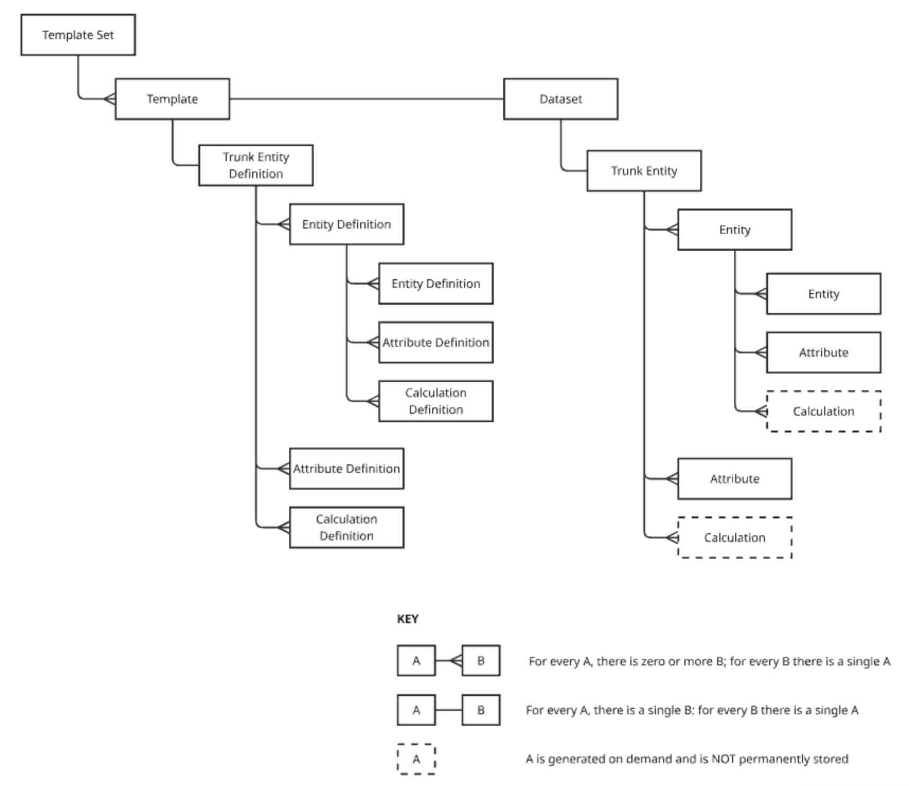
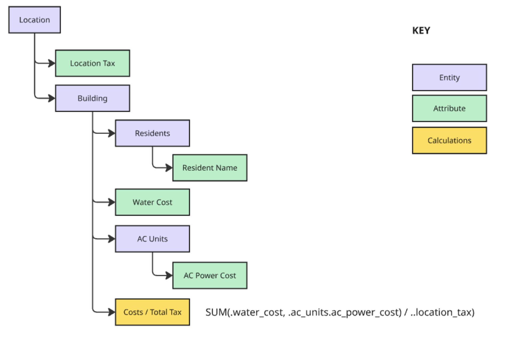

# Hierarchical Data Sets Service

# Overview

Applications provide an opinionated way to collect, organize, store, process, and retrieve information.  Traditionally, development teams pick a data storage system and then create a customized interface that enforces application-specific logic and workflows.  In many cases, common data shapes and common business rules lead to similar designs.

The Hierarchical and Customizable Datasets Service (HCDS) provides an off-the-shelf implementation for a common set of use cases where the data “shape” is hierarchical.  Examples of hierarchical datasets include, tax filings, insurance product definitions, financial aid applications, real estate listings and transactions, military specifications, and various financial transactions.  Many of these use cases for hierarchical data require data structure enforcement for fairness and transparency.

HCDS provides a means to 1\) define hierarchical dataset templates, 2\) manage template life cycles, and 3\) save and retrieve data that conforms to those templates.  The system differentiates source data from derived (i.e. calculated) data.  When designing a dataset, it is possible to define calculated fields using typical spreadsheet functions.  When data is retrieved, calculations are performed on-the-fly based on the latest source data.

All system functionality is available through an OpenAPI-compliant API.

# The Big Ideas

Before any data can be stored in the system, it is necessary to define and publish a template.  Templates define the “shape” of the data.  While there can be many templates, only one is published at any time.  Templates are composed of entity definitions, attribute definitions, and calculation definitions.  It is useful to think of an entity definition as a database table schema.  It is useful to think of an attribute definition like a database column definition.  There’s no analog for a calculation definition in databases.  Instead, a calculation definition can be thought of like a spreadsheet formula that is dependent on attribute definitions.  In order to support a hierarchical data structure, each entity definition will have a single parent entity definition and can have zero or more child entity definitions.  Attribute definitions and calculation definitions are always associated with a single entity definition.

Once a template is published, data that conforms to the template can be saved.  It is guaranteed that an entity will match its definition and that an attribute will match its definition.  When entity data is retrieved, its attributes are retrieved and any calculations are performed and included with the returned entities.

# What It Solves

Even though many applications require that data be organized hierarchically, and that computations are codified and executed in a single, transparent manner, there are no readily available services or standards that address these needs.

The HDCS aims to solve these problems seen in typical software applications:

* End users are unable to respond to changing needs quickly and effectively since they cannot modify the data schema in a self-serve fashion.  Software development teams or IT assistance is often required.  
* As use cases expand, more tables, fields, and relationships between tables are established.  Unless a rigorous (and typically expensive) process is established to govern the database schema, there will be duplicated tables and fields or, unknowingly, the same tables and fields will be used differently within the application.  
* Calculation logic is dispersed throughout an application and is often opaque to development teams and end users.

# Definitions

* **Template** \- a customizable set of elements and their relationships to each other.  
  * **Element** \- a generic reference to attribute, calculation, and entity definitions.  
    * **Attribute Definition** \- a set of characteristics that fully describe how a type of data will be collected and stored.  
    * **Calculation Definition** \- a set of characteristics that fully describe how a calculation is to be performed.  
      * **Formula** \- Describes how functions will be used to calculate desired outcomes.  This will look like a spreadsheet formula.  
    * **Entity Definition** \- characteristics that uniquely describe an entity and a set of attribute definitions that are associated with it.  
    * **Characteristic** \- a field that stores metadata about an element.  
  * **Instance** \- a data element existing in the dataset  
    * **Attribute Instance (or just “Attribute”)** \- an instance of an attribute definition placed into a dataset.  
    * **Entity Instance (or just “Entity”)** \- an instance of an entity definition placed into a dataset.  
* **Dataset** \- a collection of data consistent with a given template.

*Relationship between templates, elements, and dataset items.*

*Calculations reference uncles, siblings, and nephew attributes and calculations.*

# Getting Started \- Using the System Locally

1. Download the repository  
2. Use a Python package manager to install the dependencies  
3. Install CouchDB locally and start it  
4. Run uvicorn app.main:app \--reload to host the API locally  
5. Construct your first template using the API  
6. Publish the template using the API  
7. Use the API to populate the system with data.  
   1. Alternatively, run this command in a terminal window to add data: python \-m app.create\_data\_manually  
8. Query the data using the API

# Things to Know

## Templates

* Templates have one and only one trunk entity.  This will be the oldest ancestor for any added entity definition.  
* The trunk entity can have attribute definitions and calculation definitions.  
* An existing template can be used to create a new template.  
* Templates are in one of three statuses.  Here is their meaning:  
  * **Draft** \- This template can be modified.  Data cannot be associated with the template while it is in this status.  
  * **Published** \- This template is immutable.  Only a single template can be in the published status.  Data added to the system must conform to the published template and will be associated with that template.  
  * **Deprecated** \- This template is immutable.  Data associated with this template while it was published will continue to be associated with it.  It is NOT possible to associate additional data with this template.  
* Publishing a template in the “Draft” status will set an existing “published” template to “Deprecated”.  It is NOT possible to publish a template in the “Deprecated status.  
* Template names must be unique.  It’s possible to change their names as long as they remain unique.

## Entities Definitions

* When an entity definition is created, it receives a unique identifier.  
* Entity definition names must be unique within the set of sibling definitions.  
* It is possible to change an entity definition name but this doesn’t change the unique identifier.  
* Every entity definition must have a parent entity.  The top-most parent entity is the “Trunk” entity which is associated with the template.

## Attribute Definitions

* When an attribute definition is created, it receives a unique identifier.  
* Attribute definition names must be unique within the set of sibling definitions.  
* It is required to set the data type of an attribute definition.  When data is added for this attribute definition, that data is validated against the data type.  The following data types are supported:  
  * Short Text  
  * Long Text  
  * Rich Text  
  * Whole Number  
  * Integer  
  * Decimal  
  * Percentage  
  * Boolean  
  * Categorical  
  * DateTime  
  * Time  
  * Time Span  
* It is possible to indicate how the data should be formatted.  Downstream applications may choose to use this information.  
* It is possible to set a default value.  If an attribute value is not indicated when an entity data item is created, then the entity data item will use the attribute default value.

## Calculation Definitions

* When a calculation definition is created, it receives a unique identifier.  
* Calculation definition names must be unique within the set of sibling definitions.  
* Circular references must be avoided as the system does NOT yet check for them.  
* It is required to set the data type of a calculation definition.  Eventually, when a calculation is performed, the system will attempt to cast the results in the selected data type.  The system does NOT cast results yet.  The following data types are supported:  
  * Short Text  
  * Whole Number  
  * Integer  
  * Decimal  
  * Percentage  
  * Boolean  
  * Categorical  
  * DateTime  
  * Time  
  * Time Span  
* Eventually, calculations will ignore data from deleted entities.  This is NOT in place yet.

### *Calculation Formula Syntax*

* Formulas follow a syntax similar to spreadsheet formulas.  
* The following functions are supported and must be capitalized to be recognized:  
  * SUM  
  * DIFFERENCE  
  * PRODUCT  
  * MIN  
  * MAX  
  * MEAN  
  * IF  
  * LOOKUP  
  * QUOTIENT  
  * AND  
  * OR  
  * NOT  
  * COUNT  
  * CONCATENATE  
  * CONTAINS  
  * NOT\_CONTAINS  
* Variables in calculation formulas must adhere to the following syntax:  
  * Each variable must reference an attribute or calculation.  
  * The attribute or calculation can be an uncle, sibling, or nephew of the calculation being edited.  Entities cannot be variables.  The following syntax indicates which of these is referenced.  
    * ..uncle\_attribute  
    * ..uncle\_computation  
    * .sibling\_attribute  
    * .sibling\_calculation  
    * .sibling\_entity.nephew\_attribute  
    * .sibling\_entity.nephew\_calculation  
  * Nephew attributes and calculations represent arrays.  Each item in the array is sourced from entities containing that attribute or calculation.  
  * It is NOT possible to reference an attribute or calculation above the uncle or below a nephew.  The purpose is to keep the scope of a formula narrow so it remains comprehensible.  If a value is required outside the scope of an uncle, sibling, or nephew, additional calculations should be created above or below as required to reference the out-of-scope value.

## Copying Elements

* It is possible to deep copy an entity definition and associate it with another parent entity definition.  Calculation definitions are NOT included in the deep copy since their references wouldn’t apply.  
* It is possible to copy an attribute definition and associate it with another entity definition.  
* It is NOT possible to copy a calculation definition since it’s references wouldn’t apply and can’t be inferred.

## Data Items

* Data is added to the system on an entity basis.  It is required to indicate the type of entity to add.  When adding an entity, its attribute values must be provided.  If an attribute value is not provided, the attribute default will be used.  
* Data can only be added when a published template exists.  
* Entity attribute values may be updated.  The entity ID, the attribute definition ID, and the new attribute value must be provided.  
* It is possible to mark an entity as “deleted”.  Deleted items will be returned in query results if a flag has been set to allow it.  It is possible to “undelete” an entity.  
* It is NOT possible to update an attribute of a deleted entity.  
* When an entity is created, it is assigned a unique identifier.

## Queries

* It is possible to retrieve a single entity by its unique identifier.  
* It is possible to retrieve all entities of a given entity definition.  It is also possible to narrow the list of entities returned by attribute filtering.  The filters allowed depend on the data type of the attributes.  
* When an entity is returned, all of its attribute values are included.  Any entity-related calculations are performed and are also returned with the entity.  
* It is possible to include ancestor attributes and calculations with a list of entities.  Conceptually, this is like a left-join in SQL.  
* It is possible to retrieve the range of values and other statistics associated with an attribute definition.  Deleted entities are included when determining attribute ranges.  It is possible to filter which entities are used in the range determination.

# Opportunities to Extend This Service

This service is a proof of concept and would benefit from a number of enhancements and extensions.  Here are some:

* Record a history of every data transaction and make it accessible  
* Characterize system performance  
* Characterize any issues with multiple users modifying templates or data simultaneously  
* Provide role-based and entity-based access control  
* Allow users to create a list of custom tags that can be associated with template elements.  
* Cast calculation results into the specified data format.  Prevent users from creating calculations that may fail to cast correctly.  
* Check calculation integrity when other template elements are modified.